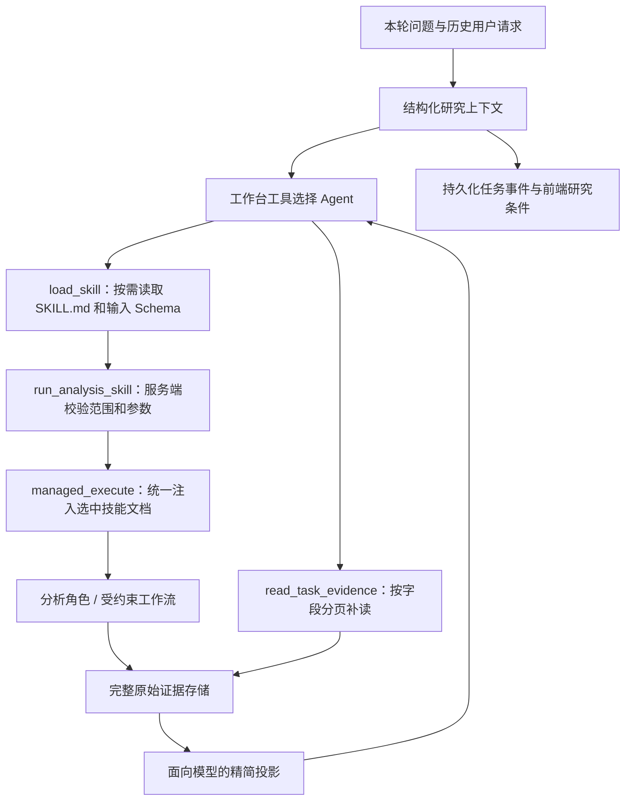

# Agent 技能文档与任务上下文

更新：2026-10-03。实现位于开发分支 `codex/agent-paper-integration`。

## 已落地的执行结构

这里的 `SKILL.md` 是项目业务技能文档。它由本项目加载器读取，不依赖 Codex 的个人技能安装目录。

### 现有技能都使用同一份文档

10 个内置技能均有 `tradingagents/skills/<skill_id>/SKILL.md`：适用范围、流程、证据要求、记忆使用规则和输出要求。

- 研究类：个股研究、市场板块、轻量筛选、持仓诊断、风险监测。文档指导工作台选择能力、选择研究维度，并注入专业角色的统一 Runtime。
- 工作流类：每日选股、持仓管理、日终复盘、策略回测、决策审计。文档解释输入和计算约束；Python 继续实现排序、交易规则、持久化与计算。
- 专业图仍由 LangGraph 表达角色依赖。增加文档不意味着把每一个确定性节点改成自由自治 Agent。
- API、调度器经 RunManager 调用 `managed_execute`；每日选股和复盘的内嵌调用也经该入口加载各自文档。直接调用底层 `execute` 属于兼容入口，不保证文档注入，新调用应使用 `managed_execute`。
- 外部旧 Python 插件缺少文档时保留原行为和 Schema；内置文档缺失、无效或超限应在验证阶段修复。

加载器只接收已知技能 ID，不接收模型指定的文件路径。标的、账户、只读白名单和写操作审批始终由代码控制；Markdown 不授予权限。

### 渐进加载与版本追溯

工作台初始提示只含能力简介和文档版本/hash。选中能力后 `load_skill` 返回该文档及 Python 生成的完整输入 Schema；本轮最多读取两个不同技能文档，不占行情取证步骤。

每个模型调用的系统上下文按需包含：当前技能文档、结构化任务状态、相关已批准经验。技能内部沿用本轮冻结的统一模型配置。嵌套执行在每次迭代后恢复父上下文，避免一个候选的标的或记忆污染另一个候选。

运行记录 `skill_refs` 保存技能 ID、文档版本、执行类型和内容 SHA256。研究复用策略键包含文档 hash；修改文档后旧研究不会未经校验继续复用。轮询/重连后的执行列表显示“读取技能流程”“整理研究对象与条件”。

文档随 wheel 和桌面侧车打包。添加能力时更新 Python 注册、Schema 和对应文档；文档版本要随行为变化递增，实际内容 hash 仍提供强校验。

## 结构化多轮上下文

`core/task_context.py` 保存目标类型、已确认标的、行业、板型/数量条件、期限、当前研究维度和接续来源。状态存于既有 `agent_events`，无需新 SQLite 表迁移。

- 本轮明确换话题时清除旧标的与条件；省略追问保留接续对象。
- 标的只有来自用户明确代码或已通过校验的技能参数才确认；助手上一轮的推荐不会自动成为用户持仓。
- 接续不复制旧证据为当前事实，也不继承操作授权。行情、记忆时点仍由服务端核验。
- 保留“排除双创”“只推荐一个”“中线”等条件；每日选股执行时兑现其支持的确定性过滤参数，中线期限传入投资风格配置。
- 语义路由仍由模型工具调用完成。保守的文本识别用于上下文整理和模型不可用时回退；当前没有把任意自由文本都转换成完整可校验的意图模型。
- 前端任务档案显示“研究条件”和接续提示。

## 完整证据与低成本补读

原始工具 JSON 完整存入 SQLite。超过展示阈值的结果只对模型和任务列表生成精简投影，附保存状态、长度、hash；省略不再意味着丢弃原始结果。

`read_task_evidence(evidence_id, path, offset, limit)` 只访问当前任务证据；嵌套字段最多 6 层、每页最多 20 项、每轮最多补读两次。大对象返回字段索引提示进一步缩小路径，不重跑市场查询、不额外调用模型压缩。

调试 API：`GET /api/v1/agent/tasks/{task_id}/evidence/{evidence_id}?path=result&path=industry_stances&offset=0&limit=5`。旧版本已经丢弃的原始 JSON 无法凭新接口恢复，需要重新取证。

## 执行恢复边界

用户点击“重新运行任务”会提交 `retry_task_id`；不自动重放中断任务。

- 相同会话、相同目标、失败或中断的只读任务才可恢复；存在模拟盘提案的任务不走查询恢复。
- 明确日期的因子和公告查询可保存检查点；3 分钟内、同标的、同参数、同供应商/模型策略的成功查询可在显式重试时复用。过期、跨日期、跨会话、失败和模拟盘账本查询重新执行。
- 沿用结果记录原任务、原证据和原始获取时间；连续复用不延长有效期。内置专业分析继续使用已有的 30 分钟分析师级研究复用规则，文档变更会使其失效。
- 当前恢复的是成功查询和有效分析师报告。尚未实现任意 LangGraph 节点在进程崩溃后的自动 checkpoint 恢复，也不恢复中途交易授权。

## 验证与后续迭代

离线回归覆盖：板块追问不切成选股、新话题清除旧条件、基本面追问继承标的、短/中/长期分离、确定性板型限制、跨会话证据隔离、文档更新失效、嵌套上下文隔离、完整结果分页与过期检查点。浏览器验证执行记录、任务档案及显式重试。

真实供应商模型的路由质量、数据覆盖和 token/金额节省仍需实际运行评测；不能由离线夹具推断投资效果。本次架构改动未增加角色模型配置项。

下一阶段可在此基础上实现独立的截图持仓输入能力、模型生成并由服务端校验的完整 TaskSpec、专业图的节点持久化，以及 Harness/Store 的进一步拆分；需各自独立验收。
