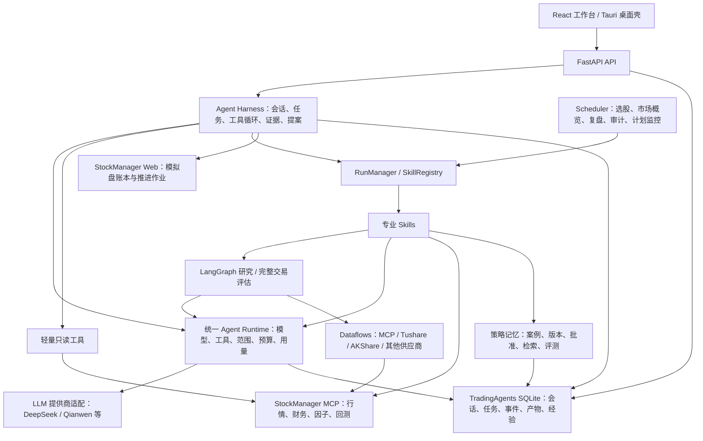

# 当前项目总览

更新：2026-10-03。对应开发分支 `codex/agent-paper-integration`。本文描述已落地代码；历史方案与阶段目标见文档索引。

## 1. 项目定位

TradingAgents 当前是面向交易研究的 Agent 工作台，包含持久化对话、行情与财务取证、多角色分析、量化候选复核、策略研究、模拟盘、决策审计和历史经验管理。

StockManager 仍是独立项目：负责 A 股数据与量化计算，以及权威模拟盘账本。两个项目通过服务接口集成，没有合并源码或数据库。TradingAgents 负责组织研究、解释证据和受控操作流程。

## 2. 整体框架



### 主对话链路

1. `/chat` 的前端实际入口是 `frontend/src/pages/AgentWorkspace/`。
2. 前端创建持久化会话、提交用户任务，通过 SSE 接收任务事件；刷新后从服务端恢复记录。
3. Harness 读取受限的历史上下文、当前标的/模拟盘范围及适用经验，建立本轮上下文和统一模型快照。
4. 模型通过原生 `tool_call` 选择只读工具、专业 Skill 或模拟盘推进提案；工具结果回传模型，继续研究或回答。
5. 服务端执行参数、标的、日期、权限、超时、轮次和 token 预算检查。模型不可用或未补足必要证据时保留规则兜底；失败不能伪装成成功。
6. 全部执行步骤、数据来源、基准日、错误、模型用量、经验参考和产物写入存储，前端显示执行提示与任务档案。

旧 `/ws/chat`、`core/chat_agent.py`、`core/orchestrator.py` 和旧 Chat 组件仍承担兼容、回退与回归职责。它们不是当前 `/chat` 页面的主会话机制，不能仅因“旧”就整体删除。

## 3. 核心模块职责

| 模块 | 负责什么 |
|---|---|
| `core/agent_harness.py` | 用户目标到结论的任务编排；多轮工具调用、上下文、证据、提案及恢复 |
| `core/agent_runtime.py` | 统一模型和工具执行、父子运行、范围约束、共享预算、用量回执 |
| `core/model_policy.py`、`llm_clients/` | 统一模型选择、渠道适配；任务冻结配置；密钥保持在服务端 |
| `core/run_manager.py`、`skills/registry.py` | 长任务创建、取消、并发、事件流、Skill 注册与发现 |
| `agents/`、`graph/` | 专业分析角色和依赖编排；结构化研究、交易与风控结果 |
| `core/research_context.py` | 有效研究复用；报告和辩论摘要；保留完整原文与原始来源 |
| `core/strategy_memory.py`、`reflection.py` | 历史经验检索、复盘归因、适用范围与截止日期控制 |
| `core/persistence.py`、`artifacts.py` | SQLite 迁移、持久化与研究产物归档 |
| `core/llm_usage.py` | 实际输入/输出/缓存回执汇总、已知模型价格估算，未知项标为缺失 |
| `dataflows/`、`core/mcp_client.py` | 数据源路由、降级、MCP 契约、连接与超时 |
| `core/stockmanager_paper.py`、`api/routes/paper.py` | StockManager Web 适配与模拟盘展示接口 |
| `core/signal_fusion.py`、`order_constraints.py` | 候选评分与量化/模型复核融合、确定性交易约束 |

## 4. 专业能力

### 10 个内置 Skills

| Skill | 功能 |
|---|---|
| `stock_analysis` | 个股研究：技术、基本面、新闻、情绪；可扩展为完整交易评估 |
| `market_overview` | 大盘状态、行业对比、新闻和市场全景 |
| `market_scanner` | 候选池扫描、量化排名和模型复核 |
| `daily_pipeline` | 每日选股流程，结合候选、风控门槛与必要的深度分析 |
| `portfolio_management` | 本地持仓查询与管理，非 StockManager 模拟盘账本 |
| `position_advisor` | 已提供持仓的调整与风险分析 |
| `risk_monitor` | 持仓/标的风险扫描及告警 |
| `daily_review` | 收盘复盘、风险检查、反思和次日计划 |
| `strategy_backtest` | 量化规则回测与结果归档 |
| `decision_audit` | 历史决策的事后核验与统计 |

轻量工具当前有 7 个：`get_paper_session`、`get_portfolio_summary`、`search_artifacts`、`get_recent_runs`、`get_mcp_factor_snapshot`、`get_mcp_risk_announcements`、`get_strategy_lessons`。Harness 另外提供 `run_analysis_skill`；绑定模拟盘且请求适合时提供 `prepare_paper_advance`。专业分析内部还有各角色的数据工具，不能把这 7 个理解为全系统全部数据接口。

### 研究与完整评估

- **研究模式 `research`**：只执行需要的分析师，适合“补充营收、行业、现金流”等追问。模型工具未指定模板时默认使用该模式。
- **完整模式 `full`**：分析师 → 多空研究 → 研究负责人 → 交易员 → 激进/中性/保守风控 → 组合负责人。独立 Skill/CLI 保留完整模式默认值。
- 这些角色共享统一 Runtime、模型策略、范围、证据、预算和用量记录；LangGraph 仍用于表达依赖，不是每个角色都成为完全自由的自治 Agent。
- 同一会话最近 12 轮、原始研究完成后 30 分钟内，范围和模型/数据/经验上下文一致且取证完整的报告可复用。失败、缺失、过期、显式持仓/选股/反思上下文或强制刷新重新执行。旧记录缺少校验字段时也不直接复用。
- 下游模型使用按预估 token 限制的原文摘取摘要；完整报告和辩论历史仍存档。压缩不产生额外模型请求，省略内容不能被解释为没有风险。

## 5. 记忆与学习闭环

```text
历史决策 / 冻结候选
    → 后续行情核验
    → 反思案例与成败归因
    → 候选经验与适用条件
    → 批准 / 停用 / 版本记录
    → 按标的、行业、风格、时点检索
    → 当前研究中注入少量相关经验
    → 保存提供记录与模型参考理由
```

历史经验用于 in-context learning，没有训练或改写模型权重。它不能替代当期行情证据，也不能改变工具权限。截止日期和版本检索避免在历史研究中引用之后才产生的经验；有/无记忆的成对评测用于衡量效果，当前不能仅凭成功执行就声称投资判断得到提升。详见 [STRATEGY_MEMORY.md](STRATEGY_MEMORY.md)。

## 6. 模拟盘与数据边界

- StockManager Web 默认 `127.0.0.1:8787`，MCP 默认 `127.0.0.1:8765/mcp`；地址可配置。
- 模拟盘的权益、现金、持仓、成交与推进结果来自 StockManager 权威账本。TradingAgents 本地手工持仓和 sleeve 信号曲线不等于该账本。
- 界面展示收益曲线、可用的子策略/指数基线、持仓明细、近 7 个账本交易日盈亏、成交、计划和运行状态。曲线按共同起点比较，缺失基线须显示缺口，不能制造数值。
- 推进流程是读取账本 → 生成绑定账户/日期/状态的提案 → 用户确认 → StockManager 执行 → 作业状态与账本复读核对。
- 任务未结束或结果未确认时不能重复推进；新账本不是仅靠模型文字或缓存来确认。
- 普通个股分析不自动注入本地缓存持仓。持仓诊断仍需要可靠输入；截图识别工作流不能被视为本次整理已实现的能力。

## 7. 前端和接口

| 页面 | 作用 |
|---|---|
| `/` | 决策工作台、候选、执行与经验概况 |
| `/chat` | 持久化交易 Agent 对话、执行过程、模型选择、用量、任务档案 |
| `/research` | 策略与回测研究 |
| `/paper` | StockManager 模拟盘、研究侧栏与受控推进 |
| `/market` | 市场全景与行业信息 |
| `/portfolio` | 本地手工持仓管理 |
| `/library` | 分析、计划、复盘、回测和记忆评测产物 |
| `/audit`、`/reflection` | 决策核验和历史经验治理 |
| `/analysis/:runId` | 专业运行详情、角色状态与报告 |
| `/settings` | 统一模型与渠道、凭据状态、分析偏好和高级配置 |

React + Vite + Tailwind；React Query 管理服务端数据，Zustand 管理界面/兼容状态。Agent 事件使用 SSE，专业运行与旧接口还保留 WebSocket。Tauri 负责桌面壳及打包后的 API sidecar。

`/reports` 重定向到 `/library`，`/watchlist` 重定向到 `/`；被替代的旧页面源码已移除，重定向保留。

## 8. 文件和运行数据

| 路径 | 内容 / 整理规则 |
|---|---|
| `tradingagents/`、`frontend/src/`、`cli/` | 可维护源码 |
| `scripts/` | 运维、验证和研究入口；用途见脚本索引 |
| `tests/`、`frontend/e2e/` | 自动化验证；live 测试需显式开启 |
| `docs/` | 当前说明、专项设计和历史规划，分别标识 |
| `assets/`、`packaging/`、`src-tauri/` | 有引用的图片、桌面打包源文件和资源 |
| `~/.tradingagents/app.db` | 默认数据库；可由 `TRADINGAGENTS_APP_DB` 覆盖 |
| `~/.tradingagents/logs/`、`cache/`、`memory/` | 默认报告、数据缓存和旧记忆日志；配置可覆盖 |
| `reports/` | 旧研究报告；启动时仍可导入，路径可能被数据库引用，保留 |
| `.local-artifacts/2026-10-03/` | 本轮归档的旧回测 JSON 和设计图片，含 SHA256 清单；不提交 Git |
| `.env`、`.dev-logs/`、`.dev-pids/` | 私有配置及现有服务状态，清理工具不处理 |
| `.venv/`、`frontend/node_modules/` | 已安装依赖，保留 |
| `dist/`、`frontend/dist/`、Tauri release/binaries | 本地交付产物，保留；重新发布必须重新构建 |
| `build/`、测试缓存、源码 `__pycache__/`、Tauri debug | 可再生成缓存；专用命令按固定白名单清理 |

不要用 `git clean -fdx` 清理项目：忽略文件中包含凭据、报告和运行状态。

## 9. 开发与维护

```bash
./scripts/dev.sh start
./scripts/dev.sh status
./scripts/dev.sh restart

# 预览清理清单；加 --apply 才删除可再生成缓存
.venv/bin/python scripts/clean_workspace.py
.venv/bin/python scripts/clean_workspace.py --apply

# 本地最小完整质量检查
./scripts/verify.sh
```

`dev.sh` 管理前后端与本地 StockManager 服务的启动/复用，并检查所需接口；使用非本机地址时外部服务由用户管理。

当前交付继续在开发分支验收，不自动合并到 fork 的 `main`。CI 包含四个 Python 版本、前端 lint/test/build/E2E、真实后端冒烟、干净安装冒烟、全仓 Ruff 和 macOS 桌面构建。

## 10. 仍需持续改进的结构

目前是统一运行时加专业工作流的架构，尚非所有业务都完全改造成自治 Agent。Harness 和持久化模块体积较大，旧兼容入口仍有维护成本；后续可按上下文管理、工具调度、证据存储、模拟盘提案和用量拆分模块，但需在保持行为和数据库迁移兼容的前提下进行。这次整理不改动交易决策核心，也不把真实历史数据当作垃圾删除。
