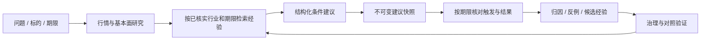

# 反思闭环与个股决策交互改进方案

日期：2026-10-04。本文区分本轮已实现的持仓停用与待实施的架构方案。

## 本轮已实现：暂停普通研究的持仓路径

- 工作台停止自动读取 `get_portfolio_summary`；规则规划、模型规划、原生工具调用和执行入口均阻止该读取。
- 工作台暂时不提供 `position_advisor`、`risk_monitor` 两个依赖手工持仓的技能。行情、基本面与标的风险公告查询继续可用。
- 个股技能保留旧输入字段兼容性，但执行时忽略 `include_portfolio_context` 和 `holding_context`，包括旧页面传入的显式上下文。
- 移除“本地持仓未核对，因此无法回答买卖问题”的自动阻断。仍然需要核验行情时点和研究证据。
- 不删除历史持仓数据。StockManager 模拟盘账本读取、持仓展示、推进与审批保留；独立持仓管理 API 和旧技能实现保留，工作台不使用它们。

## 现状核查

### 已有反思链路

个股分析和每日选股登记案例；反思引擎获取后续收益、公告与基准信息，生成归因与候选经验。交易日收盘后调度器调用反思批次，也支持手动触发。经验具有审批、退役、版本、时点与适用范围约束，专业研究和工作台最终答复均有记忆注入入口。已有带记忆/不带记忆的成对历史评测实现。

2026-10-03 对当前本地服务的只读统计：

| 指标 | 当前观测 |
| --- | --- |
| 经验总数 | 147 |
| 可用经验 | 13 |
| 待治理经验 | 112 |
| 已退役经验 | 22 |
| 可用经验范围 | 全部为行业范围 |
| 可用经验支持样本 | 每条 1 个 |
| 可用经验更新日期 | 2026-07-24 / 2026-07-25 |
| 工作台最近任务样本 | 25 个 |
| 最终答复记忆注入记录 | 1 个任务 |
| 最终答复模型报告的引用 | 0 个任务 |
| 保存的对照评测报告 | 无 |

以上使用统计来自 `/strategy-memory/overview`，只覆盖最近最多 200 个工作台任务的最终答复记录，不包括所有专业角色调用。缺少引用回执不能证明模型内部完全没有参考经验；现有统计也不能证明经验提升了收益。

### 主要结构缺口

1. **检索条件覆盖不足。** 个股技能在研究开始前检索记忆，行业主要来自选股上下文或旧持仓上下文。独立个股研究没有这些输入时，很难匹配当前全部属于行业范围的可用经验。应通过已核实的公司资料补全行业，再检索或补充记忆，不依赖用户维护持仓。
2. **单样本经验与使用条件不足。** 当前可用经验没有结构化的期限/市场环境适用字段。机会成本与风险规避经验可能相反，应保留反例并校验场景，不能按经验数量投票，也不能一键批准所有候选经验。
3. **研究与决策登记边界不足。** 普通研究模板没有交易裁决，但也登记反思案例；其 `Research` 标签缺少明确的可检验交易假设。研究资料可以存档，交易效果评估应限定有明确条件、期限和结论的建议。
4. **评价周期不匹配。** 个股案例登记没有传入期限，默认使用 5 个交易日；这不足以评价用户的中线投资判断。
5. **同日覆盖不利于追溯。** 案例 ID 由来源、日期和标的构成，同日重跑会替换原记录。应保留建议版本和完整的当时信息快照，关联 supersedes_id，而不是覆盖已评价案例。
6. **涨跌标签不足以评价执行方案。** “买后上涨”不能代表进入条件曾触发、止损未先触发，或扣除成本后可获利。条件交易需区分未触发、触发后的收益、最大不利波动、最大有利波动和退出原因。
7. **使用追踪范围不足。** 工作台最终答复与专业角色的记忆回执应合并展示，但保留“提供给模型”“模型报告参考”“验证有帮助”三个不同状态。

## 建议的统一闭环



`SKILL.md` 统一研究、决策与反思的标准；Python 实现时点校验、结果计算、权限与案例版本。经验不自动修改交易权限或硬性风控，也不额外强制增加一轮模型“自我反省”。成对评测复用冻结案例，并记录额外 token 成本；避免每次聊天同时运行两套模型。

已有归因框架、经验版本库、检索器和评测实现可继续使用。更新重点是数据契约、可评价的建议与闭环调度。

## 个股交互：先给行动摘要，再展开研究

### 建议的首屏

```text
XX公司 · 中线 · 数据截至 YYYY-MM-DD

当前结论：等待条件满足后再考虑进入
核心原因：盈利趋势尚未确认，短期估值缺少安全边际

进入条件    价格/量能条件 + 基本面或事件确认
退出条件    原投资逻辑失效、风险事件或经证据支持的价格条件
重新评估    下一份财报/事件日期，或指定观察窗口结束
证据缺口    缺少哪些数据，以及会影响哪个条件

[查看基本面] [查看技术面] [查看历史经验依据]
[把进入条件说具体] [只补估值对比] [重新评估中线逻辑]
```

示例仅展示布局，不代表任何真实标的判断。没有真实价格依据时不生成示例价位。普通个股研究不显示账户持仓诊断或可卖股数。

### 输出与流程契约

- `action_state`：可考虑进入 / 等待触发 / 暂不考虑 / 信息不足。区分研究结论、触发条件与账户执行操作。
- `horizon`、`as_of_date`：投资期限和事实截止日。
- `entry_conditions`、`exit_conditions`、`invalidation_conditions`：每项包含事实来源、观察指标、阈值（可为空）、确认周期和当前是否满足。
- `recheck_conditions`：财报、事件或时间窗口结束后的重新评估要求。
- `evidence_gaps`：仅影响相关判断，不把局部缺失扩大成全部证据失效。
- `memory_usage`：哪些经验被参考/不适用、理由及原始案例。

“讲业务、看走势、补营收”使用轻量研究模板；“现在能不能买、什么时候退出、中线是否值得进入”选择决策评估，复用有效研究后执行裁决与风控。当前普通工具调用默认 research，这是研究不自动输出交易结论的现有原因；本轮没有修改模板选择或实现新的决策卡。

决策评估必须有足够事实；取不到关键数据时仍可给出明确的等待状态、缺口和下一步，不能为了结论鲜明虚构买卖价位。

## 推荐实施顺序与验收

1. **结构化条件建议与首屏交互。** 衔接用户期限、研究复用和 full 裁决；每次答复说明当前状态、进入/退出/失效条件。验收：常见连续追问保持同标的同期限，补研究不会重新跑完整流程，缺证据不编造价位。
2. **记忆匹配和统一回执。** 用公司资料核对行业，合并工作台和专业角色使用回执，展示匹配原因、采用/未采用原因。先审阅现有 13 条单样本经验与候选池，补适用条件和反例。验收：单独输入个股也能检索行业经验；研究页可以追到原案例；过时或不匹配经验不会注入。
3. **建议快照与到期评估。** 案例版本不可变，期限与建议一致；按条件是否触发评价结果，严格标注为假设执行或模拟评估，不能视为真实账户收益。SQLite 变更需迁移与兼容测试。验收：同日重跑不覆盖原建议，未触发不判成交易亏损，中线结果不会以 5 天涨跌判对错。
4. **对照验证与治理。** 基于足量冻结样本比较有/无记忆，报告覆盖、校准、误判、收益代理指标和 token 成本；不足样本只报告不确定性。验证后再推广经验，支持退役回滚。

本轮只实现持仓路径暂停，并记录此方案；上述四阶段尚未实施。
