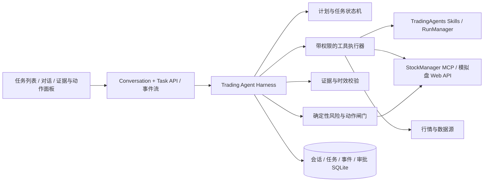

# 交易 Agent 工作台与 Harness 设计

> 2026-09-26。目标是把“聊天路由 + 独立 Skill 运行”升级为可恢复、可审计、可控制的交易任务系统；同时让界面忠实呈现真实任务状态。本文同时记录设计目标和当前实施情况，已实现范围以第 9 节为准。

## 1. 现状与设计边界

当前 `/ws/chat` 为单条消息选择直接回答、轻量工具、澄清或一个 Skill；`ChatAgent` 主要做一次 LLM 路由和回答，短期对话缓存在进程内。`RunManager` 已有 Skill 运行、取消及 SQLite 事件记录，但它只管理单个 Skill，不管理从用户目标到结论/确认的完整 Agent 任务。前端把最多 100 条消息保存在浏览器，并由最近的消息推算右侧任务档案。这些能力可以复用，但不能直接视为已实现 Agent Harness。

`StockManager` 是策略模拟盘账本和策略计算的权威来源；TradingAgents 是对话、分析、证据与审批界面。当前纸面盘的「推进交易日」是明确的账本写操作，不等同于逐笔下单。首期 Harness 允许 Agent 解释、分析、提出建议；任何模拟盘写操作都必须通过显式确认。实盘下单不在首期范围。

## 2. 用户看到的工作方式

用户从任意页面提出目标，例如“评估这个模拟盘下一交易日的风险”。Agent 创建一个可命名的任务，先展示计划，再读取当前会话账本、行情与策略证据，核对时间和冲突，给出结论、条件和来源。用户可以追问、取消、切换页面或重启应用；返回时继续看到同一任务的进度和记录。需要改变模拟盘状态时，Agent 先生成可核对的动作预览，等待用户确认，执行后把账本前后状态和结果写入同一任务记录。

界面参考通用 Agent 工作台的操作方式，但概念使用交易领域语言：任务、账户、标的、证据、策略判断、风险核对、动作预览、成交/净值结果。不要把内部模型思考过程直接展示；显示可验证的操作摘要、工具结果和决策依据。

## 3. 分层架构



Harness 是独立于 `ChatAgent` 的服务层。保留现有 `ChatAgent` 处理简单问答与兼容路由；复杂目标进入 Harness。已有 LangGraph 分析管道作为昂贵、长时的子任务按需调用，不要求每个问题都跑完整多 Agent 管道。模型负责计划和解释；工具执行、权限、账本事实、风控规则和确认状态由程序控制。沿用项目现有多模型适配，不绑定特定模型厂商。

## 4. 数据模型与状态

| 对象 | 关键字段 | 用途 |
|---|---|---|
| `conversation` | `id, title, context_scope, paper_session_id?, created_at, updated_at` | 左侧任务/对话列表；明确绑定账户范围 |
| `message` | `id, conversation_id, role, content, task_id?, created_at` | 持久化用户输入与可见回答 |
| `agent_task` | `id, conversation_id, goal, status, context_snapshot, budget, created_at, updated_at` | 一次用户目标的生命周期 |
| `task_step` | `id, task_id, kind, status, summary, tool_call_id?, seq` | 计划、工具、校验和结果的可见步骤 |
| `evidence` | `id, task_id, source, subject, as_of, retrieved_at, digest, data_ref, warnings` | 来源、数据日期、可靠性与可重读引用 |
| `action_proposal` | `id, task_id, action_type, target_account, args, expected_effect, expires_at, status` | 待确认动作，含完整参数与影响预览 |
| `approval` | `id, proposal_id, decision, decided_at, actor, idempotency_key` | 一次性授权与审计轨迹 |
| `task_event` | `task_id, seq, event_type, payload, created_at` | 断线重放与 UI 状态还原 |

`conversation_id` 是对话，`task_id` 是一次目标，已有 `run_id` 是某个 Skill 子任务；三者不得混用。`paper_session_id` 是账户/策略会话的外部标识，须在服务端验证其存在与权限。浏览器提交的页面上下文只作为提示，账户权益、持仓和成交必须由工具重新读取。

任务状态：`queued → planning → running → reviewing → completed`。必要时进入 `needs_input`、`awaiting_approval`、`failed`、`cancelled`。步骤和工具调用有独立状态；某个工具失败不必直接结束整个任务，可以在预算内换可信来源或输出有缺口的结论。审批通过后进入 `executing_action`，完成后返回 `reviewing`，核对实际结果再结束。服务重启后，未完成任务标为 `interrupted`，从安全检查点恢复或明确要求重试；绝不自动重放写操作。

每个事件有单调 `seq`，客户端以 `last_seq` 重连补齐。写动作使用 `proposal_id + idempotency_key` 去重，提交前重新获取账户状态并校验提案尚未过期。取消应终止可取消的读取/计算；若外部写入已经提交，显示“执行结果待核对”，而不是虚报取消成功。

## 5. Harness 一轮任务的执行契约

1. **解析目标与作用域**：识别问答、研究、模拟盘诊断、策略调整建议、写操作；缺少标的、日期或账户时只问必要的问题。明确使用哪个模拟盘账户和市场时点。
2. **生成有限计划**：通常 2–5 步，标记必需证据、工具类别和停止条件；简单事实问题直接调用工具回答。为模型调用次数、工具调用次数、总耗时和数据费用设置上限。
3. **执行工具**：通过登记表调用工具；每项工具必须声明输入/输出 Schema、作用域、权限类别、超时、重试策略和数据源。现有轻量工具与 Skill 包装为统一调用接口。失败/超时应产生事件并可见。
4. **构建证据包**：保存来源、标的、数据截至日期、获取时间、工具版本、关键字段摘要。对行情过期、账本日期落后、来源冲突及缺失数据做程序检查；相关结论不能伪装成当前事实。
5. **风险与动作闸门**：对拟议交易或模拟盘操作进行确定性检查，如账户/策略范围、现金和仓位、集中度、交易日与停牌、涨跌停、T+1、费用和数据时效。规则可按市场与动作配置；模型不能覆盖失败的硬规则。
6. **合成回答**：结构化输出 `summary / verdict / reasons / risks / assumptions / evidence_refs / next_actions`。区分“策略已有决策”“Agent 的分析建议”“用户批准的操作”“账本实际执行结果”。可追问时保留任务和证据引用。
7. **写操作**：创建不可变动作预览，显示会话、日期、具体参数、预期影响、数据时点与风险检查；用户确认后服务端再次核对，再调用 StockManager，读取回执并对账。作业成功但 `advanced_days=0` 且账本未变化时，标记“账本未推进”并保留作业编号；回执与账本的账户、日期或推进天数矛盾时转入人工核对，不报告推进成功。首期不允许模型自行直接写账本。

工具权限分级：`read`（行情/账本/报告）、`compute`（回测/深度分析）、`paper_write`（创建或推进模拟会话）、`live_trade`（首期禁用）。`paper_write` 的确认针对具体提案，不是对整个对话的一次笼统授权。已有的“推进交易日”只能以它当前的真实语义作为动作；若未来要做逐笔模拟订单，先补 StockManager 的订单 API、回执和幂等性，再开放对应工具。

外部新闻、研报、工具响应均视为不可信数据，不能携带系统指令或批准动作。模型可引用其内容，但权限、账户范围和动作参数由服务端校验。密钥与完整内部提示词不进入事件、日志或前端。

## 6. 交易场景的记忆和权威来源

| 信息 | 权威来源 | 记忆方式 |
|---|---|---|
| 模拟盘权益/持仓/成交/下一日计划 | StockManager 会话账本 | 每轮重新读取，历史快照只用于比较 |
| 策略信号与回测 | StockManager MCP 或对应产物 | 保存版本、参数、回测窗口与数据时点 |
| 用户目标与约束 | 当前对话及用户档案 | 明示固定约束，可编辑、可撤销 |
| Agent 判断 | 当前任务证据与模型输出 | 保存结论与证据引用，不当作市场事实 |
| 实际操作与结果 | StockManager 回执/账本 | 执行后复读核对，关联审批与任务 |

跨轮对话使用持久化摘要、当前任务计划与被固定的约束，避免把全量历史持续塞给模型。切换模拟盘会话必须切换作用域；旧任务可以查看，但不得把旧账户证据当作新账户当前数据。

## 7. 界面与设计稿的修正

现有实现保留了“主对话 + 右侧任务档案”的骨架，但样式和行为尚未对齐设计稿：全局使用深色底与多层大圆角卡片，设计稿默认是深绿导航、浅色内容背景、细分隔线和较轻的卡片；现有侧栏约 224px、顶栏约 72px，而设计稿的侧栏约 165px、顶栏约 51px；右侧档案目前根据最近消息拼接，尚不是任务事实；模拟盘的嵌入对话隐藏了档案，缺少跨页面持续的任务体验。

统一视觉变量从设计稿迁入应用级 token：浅色 `background #f4f5f2 / panel #fff / panel-soft #f8faf8 / line #dfe6df / text #1f2922 / muted #68776d / accent #087d68`，侧栏 `#222824`。深色作为同一 token 的主题变体，不在各页面直接写 `stone-*` 或十六进制。默认跟随系统主题，并提供明确主题切换；交易状态颜色需有文字标签，不仅靠颜色。阅读字号不照搬示意图的 11px，应保持正文约 14px、辅助信息约 12px。

布局改为：窄应用导航 + 可折叠任务列表 + 中央对话/执行流 + 按需展开的右侧证据面板。桌面上中央内容宽度控制在适合阅读的范围；移动端任务列表与证据面板以抽屉切换。导航和顶栏压缩，正文减少重复容器与边框。输入栏固定在底部，显示当前账户、标的、日期和任务模式。以下组件只渲染服务端事件，不靠前端猜测：计划步骤、工具状态、证据快照、确认卡、执行回执、失败与恢复提示。

```text
┌──────────┬───────────────┬──────────────────────────────────┬──────────────────┐
│ 主导航   │ 对话/任务列表 │ 当前任务：评估模拟盘下一交易日风险 │ 证据与操作       │
│ Agent    │ ● 运行中      │ 用户目标                          │ 账户 + 基准日    │
│ 模拟盘   │ ○ 等待确认    │ 计划 ①账本 ②行情 ③风险核对         │ 来源/时效/冲突   │
│ 研究     │ ✓ 已完成      │ 工具步骤与结果摘要                │ 建议与条件       │
│ 审计     │               │ 结论 / 风险 / 引用                │ 确认操作（如需） │
│          │               │ ───── 输入与上下文 ─────          │                  │
└──────────┴───────────────┴──────────────────────────────────┴──────────────────┘
```

模拟盘页面仍展示完整账本，但与 Agent 使用同一 `conversation_id/task_id` 体系。用户从模拟盘提问时自动绑定当前 `paper_session_id`；打开 Agent 主界面可以继续同一任务。模拟盘账本和 Agent 建议应相邻而分明，避免把建议误认为实际持仓。

## 8. 分期交付与验收

| 阶段 | 交付 | 验收标准 |
|---|---|---|
| A. 视觉与会话底座 | 全局 token、工作台外壳、任务列表；会话/消息/事件持久化及重连 | 刷新/重启后任务、消息和证据顺序不丢；浅色与深色可读；与设计稿关键布局一致 |
| B. 只读 Harness | 目标解析、有限计划、受控工具、证据包、结构化回答 | 对当前模拟盘提出复合问题，可见真实调用步骤、数据日期、来源和缺口；不会串账户 |
| C. 深度研究 | RunManager Skill 作为子任务、取消/超时/恢复、结果链接 | 跨页面持续运行；取消和失败状态准确；已有分析/回测结果可复用 |
| D. 模拟盘动作 | 明确提案、一次性确认、服务端复核、幂等与回执核对 | 未批准绝不写账本；重复点击/断线不重复写；显示操作前后账本事实 |

优先完成 A+B 的垂直切片，再做 C/D。不要先把所有页面换皮后再补数据契约，否则界面会继续展示推算出来的“假任务状态”。

关键离线验证场景：过期行情、相互矛盾的来源、StockManager 断开、工具超时、服务重启和事件重连、取消与写入竞态、切换账户、新闻中的指令注入、提案过期、重复确认。使用固定数据夹具验证状态机与风控；真实模型与数据源作为独立集成测试。

## 9. 实施状态（2026-09-26）

已实现第一条 A+B 垂直链路：SQLite 保存对话、消息、任务、顺序事件和证据；模拟盘会话固定绑定；Agent 主界面和模拟盘内对话共用任务 API；前端直接显示服务端步骤与来源，刷新后恢复记录；受控分析 Skill 可作为子任务，取消会传递到子任务；模拟盘账本不可用时不生成交易判断。主界面已使用设计稿的浅色内容区、深绿导航和细分隔线。

创建模拟盘对话时，服务端先只读 StockManager `/status`，确认会话存在、返回账户一致且账本日期没有内部矛盾，再持久化绑定；不存在、断开或异常响应会直接拒绝创建。任务执行时仍重新读取账本，不把创建时的校验当作后续交易事实。

已实现首个 D 阶段动作：用户明确要求“推进模拟盘到 YYYY-MM-DD”时，Agent 先读取账本并生成 15 分钟有效的提案。用户点击确认后服务端重新核对账户基准日，一次性提交 StockManager 推进任务、轮询回执并复读账本。重复确认不会再次提交；外部请求结果不确定时标记待核对，不自动重试。原模拟盘页面的推进操作继续使用页面自身的确认流程。

推进提案现在还固定生成时的账户资金、持仓和策略配置指纹。账本缺少完整资金/持仓快照时不生成提案；确认前即使日期未变，只要这些账本事实变化或旧提案没有指纹，原提案就失效且不会提交 StockManager。股票名称和按缓存补齐的当日盈亏只用于展示，不进入指纹。

TradingAgents 会把 StockManager 返回的 `state_fingerprint` 随已批准提案提交；StockManager 在策略计算前和账本 SQLite 提交事务内再次比较。单策略账户同日变化时，推进作业不会覆盖新账本。组合策略还会在启动子策略前校验，但子策略与组合账户尚不是一个跨会话事务；计算期间若发生其他并发写入，仍可能出现子策略已推进而组合账户提交失败。Agent 对组合作业失败始终保留“待核对”，即使组合账户日期未变，也不会推断子策略未推进或允许直接重试。

已补充异常状态下的人工对账操作：模拟盘提交后若轮询中断，保留 StockManager 作业编号；服务重启后将提案标记为待核对。用户可点击“核对执行结果”，服务端只读取作业回执与账户账本，不重复提交。仅当成功回执的账户、日期与账本一致时标记完成；作业编号随 StockManager 重启失效时仍显示账本观察日期，但不推断该提案已完成。

同一模拟盘账户若存在执行中或结果待核对的推进提案，其他对话不会再生成新推进提案；已有待确认提案也无法通过确认闸门。该限制在 SQLite 更新条件内原子检查，前一次执行结果核对完成后才允许后续推进。

已加入有预算的模型规划：配置了所选 LLM 服务时，模型可提出最多四步的只读工具与分析 Skill 计划，服务端逐步校验工具、参数和账户范围；模型不可用时回退确定性计划。非关键工具失败后最多追加一次只读计划，执行流会记录 `plan_revised` 供前端展示。模拟盘账本或当前持仓属于必需证据，读取失败时即使其他产物可用也不生成交易判断。模拟盘写操作仍走原有确定性提案与确认流程。

模拟盘证据现会核对返回账户、会话日期和快照日期。账户串线、日期格式错误或同一账本内日期矛盾时，该证据标记失败并展示原因；Harness 不用它生成交易判断或推进提案。历史模拟盘日期本身不视为错误，因为模拟盘可能有意停在过往交易日。

手工持仓工具按数据库实际的 `avg_cost` 字段计算估算盈亏，返回每条记录的更新时间，并明确提示价格是本地保存值，尚未核对实时行情或价格时点。

未绑定模拟盘且没有明确标的的买卖、加减仓决策问题现会先要求补充 A 股代码，不再落到旧聊天路由生成无证据回答。用户紧接着只回复代码时，新任务保留原决策问题、绑定该代码并重新取证；原始回复和解析后的任务目标分开审计。若问题涉及手工持仓，即使同时读到标的因子，Harness 也会说明本地持仓和保存价格未经交易账户与当前行情核对，本轮不生成买卖或加减仓判断；一般交易知识问题仍可走普通对话。

用户目标中明确写出 A 股代码（如 `600519.SH`）并询问一般股票信息或估值、行情等因子时，Harness 会将代码绑定到 StockManager MCP 的只读因子快照工具；模型提出的其他代码会被忽略。一次可核对一到两个明确标的，更多标的会要求缩小范围。模拟盘内提问仍必须同时核对绑定账本。MCP 返回错误、错误标的、错误基准日或完全没有原始因子值时，本轮不把该结果用作当前标的判断；部分覆盖的结果会标出缺失维度。

明确提到公告、问询、立案、处罚等事件并给出 A 股代码时，Harness 还会查询 StockManager MCP 的风险公告关键词命中日期。纯公告问题只查公告；同时询问估值等因子时才并行核对因子。模型不能改查其他标的；模拟盘查询截止日固定为已核对的账本基准日，账本缺日期或返回截止日不一致时停止生成交易判断。若账户、标的和分析步骤超过四步预算，任务要求缩小范围，避免默默省略必需证据。该 MCP 契约没有公告标题和原文，因此回答与证据卡只能陈述关键词命中日期及查询区间；零命中不代表没有风险公告，也不能据此评定事件性质或严重程度。

股票追问可引用同一对话紧邻上一项任务的唯一明确代码，例如先问 `600519.SH` 估值，再问“那它的公告呢”。Harness 在事件中记录服务端解析出的代码，并为新任务重新取证；上一项任务涉及多只股票或没有明确代码时要求用户补充。计划和回答模型只能使用服务端确定的标的范围，旧证据不会被当作本轮当前数据。

纯公告问题不会为凑上下文读取手工持仓或旧分析产物；只有用户明确询问账户、交易动作或相关历史报告时才开放对应工具。零命中属于有效扫描结果，回答不得把它描述成工具不可用，也不得承诺调用当前系统没有提供的公告原文接口。

模拟盘内涉及明确标的的问题，因子查询使用先读到的账本基准日作为交易日期，不接受模型指定另一日期。若因子源返回不同基准日，证据档案标出冲突；复核后仍不能对齐时，本轮停止合成跨日期的交易判断。历史模拟盘因此可能遇到因子源没有对应日期数据的情况，届时明确说明无法核对，不以当前行情代替历史数据。

因子源首次返回与模拟盘账本冲突的日期时，Harness 在四步预算内可按同一标的和账本日期只读复核一次，并记录 `plan_revised`。初次冲突和复核结果都保留在任务证据中；回答模型只接收该工具的最新观察。复核仍冲突或预算已满时不生成跨日期判断，也不会改用当前行情替代账本日期。

模拟盘账本缺少基准日时，Agent 不生成交易判断。用户询问计划、策略切换或调仓时，若账本明确标记计划不可引用或不是最新版本，Agent 直接说明原因，不把旧计划交给模型解释成当前建议；账户权益等事实查询仍可使用带日期的账本证据。

对一般账户或风险问题，若账本标记计划不可引用或不是最新版本，提交给回答模型的证据副本也会隐藏 `next_plan` 并注明限制。任务数据库仍保留原始工具结果供审计；模型可以说明账户权益等已核对事实，但不能把该计划当作当前交易依据。

单策略模拟盘没有组合会话的 readiness 元数据时，Agent 会将下一日计划的 `signal_date` 与账本基准日核对。计划缺失、生成出错或日期不一致会标记为不可引用，并沿用服务端的交易判断闸门；真实计划内容仍保留在审计证据中。接口测试覆盖了日期过期时对买入计划的拒绝。现有账本副本中四条已缓存计划的信号日均与账户基准日一致，日期校验不会误拦这些会话。

真实 MCP 因子快照联调发现：服务可能整体返回 `success`，但某个 `data_coverage` 维度为 `missing`，对应 `factor_scores` 仍带默认 50 分。Harness 现按维度追加缺失警告，并只在提交给回答模型的证据副本中隐藏该维度得分；持久化的 MCP 原始结果保留供审计。回答提示限定：只有缺失维度的分数是占位值；可用维度的分数若无评分定义，只报告数值，不推断中性或方向。

长时间读取/分析任务在服务正常关闭时标记为“已中断”，保留既有消息、步骤和证据；用户可在任务时间线显式点击“重新运行任务”创建新任务。模拟盘写操作中断时仍进入“执行结果待核对”，不会出现重新提交入口。此机制是安全的显式重试，尚不等于从 Skill 内部检查点自动续跑。

Agent 任务事件现提供按 `seq` 续读的 SSE 接口；工作台在任务运行时使用带认证请求头的流连接，收到步骤或结果事件即刷新对应对话和列表。连接中断后从已收到的序号重连，完整对话低频轮询保留为降级路径；任务完成、要求补充信息、等待提案确认或进入待核对状态时关闭事件流。接口测试覆盖事件重放、断点续读和等待确认时的结束帧；浏览器测试覆盖运行中任务收到事件后的界面更新。

同一对话的新任务提交与同一任务的事件编号现由 SQLite 写事务串行化。多个并发请求同时提交时只允许一个活动任务；并发事件写入仍产生连续的 `seq`，保证断线续读不会因撞号丢失事件。

对话列表现由服务端按普通对话或模拟盘账户筛选，并以每页 50 条加载历史记录；移动端与桌面端都可继续加载。旧对话直达链接会读取并核对其账户范围，即使它不在第一页仍可打开，也不会短暂显示其他对话。接口测试覆盖各有 125 条记录的普通和模拟盘作用域、分页边界及非法参数；浏览器测试覆盖第一页之外的直达链接和继续加载。

全站页面和共用组件已接入语义视觉 token：默认按系统明暗主题显示，顶栏可切换并记住选择；导航、顶栏和内容区统一尺寸与配色。Agent、研究、模拟盘及移动端反思页已做明暗浏览器截图核对。反思、决策工作台、产物库、工具卡和市场组件中的旧配色已换成主题 token，辅助文字统一至少约 12px；模拟盘净值与 K 线图使用主题色，净值曲线在数据加载后立即完整呈现。移动端次级导航会标记当前页面。旧页面中的静态卡片层级与交互细节仍需继续按设计稿打磨。

模拟盘内嵌 Agent 现在可通过“在工作台继续”带上当前账户与对话 ID 打开主 Agent 工作台；主工作台按深链接选中原对话，返回账本时保持同一模拟盘会话。手动切换或新建对话会同步更新地址，刷新后仍选中该对话。浏览器测试覆盖跨页接续、多个同账户对话时的指定对话选择，以及切换后的刷新恢复。

旧版浏览器本地聊天会在打开 Agent 工作台时按普通对话和模拟盘账户分别导入新会话库。导入幂等，原本地记录保留；历史文字以只读存档呈现，不生成任务或证据，也不会重新核对旧行情。继续分析需新建对话，让 Agent 重新读取当前数据。

任务档案现可从每条历史回答和任务时间线打开，显示该任务自己的证据，不会把旧回答误配到最新任务。模拟盘内嵌对话也能展开档案。账本、手工持仓、MCP 因子和风险公告证据展示可核对的关键字段、来源、基准日、获取时间及警告；失败的证据只显示失败信息，不展示推算字段。从其他页面带问题跳转到只读旧聊天存档时，会自动新建对话再提交问题。

Agent 工作台的证据卡将来源、基准日、获取时间分行显示，数据警告和读取失败有文字状态；辅助文字统一到至少 12px。任务时间线展示服务端 `plan_revised` 的调整原因，已结束且没有步骤记录的任务不再误显示“正在解析”。桌面截图与浏览器交互测试已核对上述信息层级。

手机端证据档案以带遮罩的抽屉显示，可按 Esc、点遮罩或点关闭按钮返回对话；关闭后输入区仍可使用。390px 视口截图和浏览器测试已核对无横向溢出，完整前端 E2E 覆盖了抽屉与模拟盘、审批、跨页会话等交互。

本地验收可运行 `./scripts/dev.sh`：脚本先启动或复用 StockManager Web 与量化 MCP，再启动后端和前端。`./scripts/dev.sh status` 分别检查四个服务；量化 MCP 缺少必要数据源凭据时可启动，但相关量化能力会在服务健康信息中显示为不可用。浏览器从 `http://localhost:5173/chat` 进入 Agent 工作台。

2026-09-26 的真实只读联调：四服务可联启，后端识别到 StockManager MCP 量化能力；在临时 SQLite 会话中经 Agent REST API 提交 `600519.SH` 问题，任务完成并保存 `get_mcp_factor_snapshot` 证据，基准日为 MCP 返回的 `2026-09-24`。此联调以固定回答替代模型合成，因此证明工具、事件与持久化路径，不证明真实模型回答质量。

同日补充真实模型验收：临时任务库配合 DeepSeek `deepseek-chat`，REST API 的 `600519.SH` 只读任务由模型生成计划、StockManager MCP 返回基准日 `2026-09-24` 的因子快照、模型据此回答估值和缺失维度。首轮回答未给买卖指令，但暴露了缺失的 `flow` 维度默认 50 分可能被误读为中性；上述证据掩码与提示修正即来自此验收。修正后重启服务复验，任务完成、计划来源为模型、证据保留原始 `flow=50.0` 并附缺失警告；回答把 `flow` 明确列为缺失，其他可用维度仅报告原始分数，不推断中性或买卖方向。

同日风险公告任务的真实链路验收：使用临时 SQLite、实际 StockManager MCP 与 DeepSeek `deepseek-chat` 提交 `600519.SH` 公告问题。模型计划只选 `get_mcp_risk_announcements`；MCP 对截至 2026-09-24 的 90 天查询返回零命中；任务保存工具证据并完成回答。模型明确表示无法据零命中判断是否立案，并说明缺少公告标题和原文。此结果验证该次只读链路，不证明数据源对所有公告的覆盖率。

追问验收在临时对话中先记录 `600519.SH`，再问“那它的公告呢？”；服务端记录 `scope_resolved=600519.SH`。首次真实模型计划多查了旧产物和持仓，并在回答中暗示未提供的接口；收紧工具选择和回答约束后复验，模型计划仅执行风险公告扫描，证据标的为 `600519.SH`，回答明确说明零命中和无法调取公告全文的边界。

真实前后端浏览器冒烟新增缺少标的的交易问题场景：用户输入“现在要不要买入茅台？”，Agent 要求补充代码；直接回复 `600519.SH` 后，任务保留原问题、记录 `scope_resolved`，用户原始回复仍单独保存。测试环境刻意关闭 StockManager MCP，最终任务保存因子工具失败证据并明确不生成交易判断。该测试验证浏览器、REST、任务持久化和故障边界，不替代真实行情与模型质量验收。

2026-09-27 复跑这组真实后端浏览器测试时发现：已有旧对话的情况下，用户新建对话后立刻发送问题，列表刷新前界面会暂时回退到旧对话，导致消息写进旧对话。创建成功后现立即把新对话加入前端缓存并选中，创建期间禁用重复新建和发送；同一冒烟场景会核对问题及追问都保存在刚创建的对话中。复验结果为真实后端冒烟 5/5、前端 E2E 24/24、单测 120/120，并通过 lint 与构建。

绑定模拟盘账户时，Agent API 现在先调用 StockManager Web 的状态接口，验证账户确实存在、返回的账户 ID 匹配且账本日期不冲突，再保存对话。2026-09-27 使用 StockManager 实际 `runtime_v2` 路由、临时 SQLite 和本机 HTTP 做隔离联调：单策略与组合策略账户均能绑定、完成只读任务并保存带账户 ID 和基准日的证据；不存在的账户返回 404。任务回答在这次联调中使用固定文本，真实模型对实际策略会话的回答仍需验收。

随后将现有 StockManager SQLite 账本复制到临时目录，以实际组合会话数据复验只读链路：Agent 任务完成，记录的账户、2026-09-24 基准日、权益和计划复核状态与状态接口一致，原账本未修改。真实账户数据未发送给外部模型。只用虚构账户样本测试了 DeepSeek 回答：模型能准确报告权益、现金与基准日；不可引用的计划由服务端直接阻止生成交易判断。测试还发现“只报告账本事实”会因“报告”二字误触发历史产物检索，现已把该工具限定为明确询问已有报告、回测结果或历史产物的任务。

模拟盘写链路现可用 `.venv/bin/python scripts/verify_agent_paper_live.py` 独立复验（StockManager 仓库不在同级时设置 `STOCKMANAGER_ROOT`）。脚本将 StockManager 源码复制到临时目录，创建虚构账户和日期，使用确定性的模拟策略推进器；TradingAgents 与 StockManager 各经真实本机 HTTP 服务通信，任务库和账本均为临时 SQLite。2026-09-27 验收结果：确认前账本仍为 2026-09-24；连续两次确认只提交一次推进作业，且请求携带并在 StockManager 事务内核对状态指纹；作业回执与复读后的 2026-09-25 账本相符，提案和任务完成并保留完整事件。随后请求推进至非交易日 2026-09-26，作业虽成功但推进天数为零，账本仍在 2026-09-25，提案明确显示“账本未推进”；重复确认没有产生额外作业。第三次提案生成后只改动同日现金，确认被判为“提案已失效”，推进作业数仍不增加。这验证审批、幂等、作业轮询与对账的跨服务链路，不验证真实策略计算或行情数据。

尚待实施：基于证据冲突和时效的进一步重规划、更丰富的交易工具、Skill 内部检查点续跑。逐笔模拟下单和实盘交易没有开放给 Agent。
