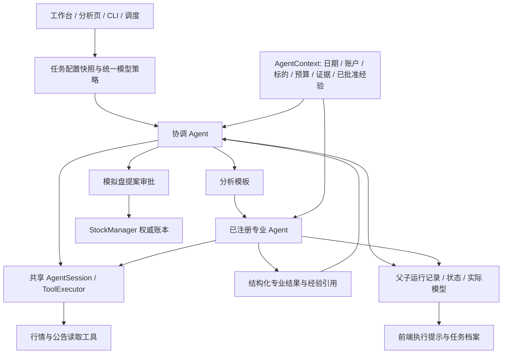

# 统一交易 Agent 架构迁移

目标：对话协调、股票分析、候选复核、板块研究、持仓诊断共用 Agent 运行时；保留确定性风险检查和模拟盘审批。

## 完成要求

- [x] 模型策略统一：默认模型覆盖全部入口，可选深度模型覆盖；旧配置迁移、供应商连接统一、运行开始冻结配置。
- [x] AgentSpec / AgentContext / AgentSession / ToolExecutor：对话和专业分析共用工具调用循环；结构化单轮判断也使用相同运行时。
- [x] 父子运行：专业 Agent 有独立运行 ID、父任务、预算、取消状态、输入作用域和结构化结果；支持持久化查询。
- [x] 股票流程：原分析师/研究员/交易员/风控作为专业角色注册；完整分析以流程模板编排，局部分析选择所需角色。
- [x] 证据与记忆：各角色使用统一上下文和检索服务，子任务输出携带证据/经验引用，协调层不通过长 Markdown 猜测结果。
- [x] 其他入口迁移：板块、候选、复盘和持仓能力使用同一模型与执行机制；CLI、定时任务、页面发起一致。
- [x] 前端：单一模型入口；展示实际角色/模型和父子活动，保留既有历史记录、审批和断线重放。
- [x] 验证：固定数据覆盖目标继承、工具权限、并行预算、取消、迁移兼容、结构化结果、完整/局部分析；后端/前端/E2E 均通过。
- [ ] 交付：提交推送；本地服务更新；PR、CI 与审查按仓库流程完成，缺失门禁不得标记完成。

## 设计约束

角色决定职责、工具与输出；运行时负责模型选择、执行循环和状态。分析模板决定必需步骤与依赖。StockManager 保持账本权威来源。子任务只获得父任务允许的账户/标的/日期范围和预算。模型无法绕过审批或扩大工具权限。

旧 quick/deep/agent 配置只用于迁移与接口兼容。新任务的显式 model_policy 决定模型；运行中的任务保持其配置快照。

## 当前实现（2026-10-02）

### 代码入口

- `core/model_policy.py`：唯一默认模型与可选深度覆盖、旧配置兼容、供应商参数、任务快照。
- `core/agent_runtime.py`：上下文、共享预算、模型运行、工具权限与作用域、通用工具循环、父子结果与取消。
- `core/agent_specs.py`：专业角色和模板注册。LangGraph 继续描述工作依赖，各节点由同一运行时执行。
- `stock_analysis` 支持 `analysis_template=full|research`。研究模板只创建选中的分析师，完整模板保留研究裁决与风控。
- `specialist_results` 是专业角色的结构化产物；协调层引用结构化决策和简短研究摘要，完整结果保留运行 ID。
- 新增 `agent_runtime_runs` 表，采用增量建表；原任务、报告、持仓和模拟盘数据保留。服务启动将遗留运行态标记中断。
- `/api/v1/runs/{run_id}/agents` 查询分析父子运行；工作台任务详情返回 `agent_runs`。运行事件在终态之前落盘并回放。
- 角色收到的经验写入 `memory_refs`；结构化角色可报告 `memory_usage`，只有实际提供的经验 ID 才被接受。前端分别显示提供数量、报告参考和未报告情况。
- 专业角色结果包含 `tool_observations`：从持久化子工具记录恢复实际执行状态与返回片段，同时补齐证据引用，避免异步上下文复制丢失工具引用。协调层接收报告首尾及工具返回记录，明确区分部分数据缺失和全部不可用。

### 验收步骤

1. 启动 `./scripts/dev.sh start`，打开设置。选择默认模型；高级设置的深度模型可继承默认。保存一次后所有入口使用同一策略，运行中的任务保持原快照。
2. 工作台请求某只股票的行情/新闻研究，选择研究模板；查看实际子 Agent、模型、价格/公告查询和报告摘要。
3. 发起完整分析，确认分析师之后有多空研究、交易员和风控角色，并返回结构化最终结论。
4. 分析期间展开任务档案并刷新页面，确认角色层级、完成/失败状态、证据与经验记录恢复。
5. 取消长任务，确认本任务停止且下一任务能够运行。模拟盘推进仍需要核对账户、日期和明确审批。

### 验证与边界

- 合并 main 后的后端全量非 live 回归：1,463 通过、1 跳过、1 live 排除（70 个子测试通过）。
- 前端单元：140 通过；交互 E2E：44 通过；真实后端冒烟：6 通过；lint、Ruff、类型检查与生产构建通过。
- 使用固定模型/数据验证完整及局部流程、共享记忆、原子预算、参数权限、分支取消、旧库迁移和刷新恢复。没有进行付费真实模型效果评测。
- 工具返回数据缺失、模型服务故障时仍会明确降级；本次迁移不代表推荐质量或收益已得到实证提升。
- 最终交付门禁：提交、推送、本地服务更新、PR、CI 和审查。已创建 [PR #1](https://github.com/Limbor/TradingAgents/pull/1)，云端检查结果和审查仍需逐项确认。

## 与 main 的交付兼容检查

- 合入 `main` 的 v0.3.0 更新，逐项融合 13 个冲突文件；统一 AgentSession、结构化专业结果和经验引用保留。
- 同时保留上游可选数值空字符串处理、结构化输出降级、本地兼容模型、CLI 环境优先级和报告树导出。
- 保留 `uv.lock`：本分支 CI 明确执行 `uv sync --frozen`；`uv lock --check --offline` 验证通过。
- 修复板块研究重复传入供应商参数的问题，补充非空 temperature / reasoning 设置验证。
- 可选研究/复核在没有模型配置时明确降级，不因为测试或服务环境中存在 API key 就隐式启动默认模型调用。
- 合并后的全量回归 1,463 项和真实后端冒烟 6 项通过；PR 已创建，云端 CI 与审查尚未完成。

## 首轮云端 CI 修复

- 模拟盘 E2E 等待包含 `conversation` 的持久化 URL，避免错误要求问询后必须没有查询参数；账户绑定、页面刷新和工作台往返检查保留。
- 将手写 PyInstaller 配置纳入源码，修复通配忽略 `*.spec` 导致干净检出缺少桌面打包配置的问题；入口和项目路径相对配置目录解析。
- 开发依赖显式声明 `pytest-asyncio` 并锁定版本；本地已有插件而干净 CI 没有插件时，异步测试无法执行。通过禁用本地自动插件加载复现，并使用独立锁定环境验证修复。
- 非 live 测试默认关闭 API 启动时的远程名称补全，防止测试退出等待外部行情线程；同时处理默认配置重载后 API 保留旧字典的情况。配置重载与决策审计组合回归 52 项通过；显式 live 测试保留原行为。
- CI 线程诊断发现计划推进 API 用例意外调用真实行情，且限流器测试遗留模拟时钟的全局桶。改为注入固定行情并在用例后恢复桶和配置状态；组合回归 22 项通过，额外检查确认整个限流器模块执行后原对象和配置均恢复。生产限流设置保持原行为。
- 四版本 CI 定位到 Python 3.10 的超时异常兼容问题：同时捕获异步和 SDK 的内置超时异常，统一返回明确的超时降级提示。两类异常回归纳入 ChatAgent 模块，40 项通过。
- 桌面安装组包含 API 和 MCP 运行依赖。PyInstaller sidecar 构建通过，并以独立端口和临时数据库实际启动，健康接口返回 HTTP 200。
- 本地完整 Tauri 构建通过，生成 `.app` 与 `.dmg`；云端桌面作业仍需在最终提交上确认。
- 首轮 Ruff、干净安装和真实后端冒烟通过；前端和桌面构建失败项修复后需在新提交上重新验证。

## 太极实业实测问题修复（2026-10-02）

- 用户实测任务已调用工具：行情失败源于缓存日期为 Timestamp、新下载日期为字符串，增量合并排序报错；AKShare 与 TuShare 均统一清洗新增日期后再合并。两供应商的真实日期格式回归同时验证缓存复用和基准日截断。
- 公告、财报与新闻实际已返回，原协调层只截取每份报告开头 400 字，误把开头的缺口声明当成全部信息。现在保留报告首尾，明确片段标记，并携带实际工具执行记录；汇总提示区分关键词公告扫描和公告标题接口。
- 使用临时缓存实测 TuShare，太极实业日线补齐至 2026-09-30，行情报告、RSI 与验证快照均可返回；未调用大模型重跑，也未修改账户。
- 用原实测任务验证摘要仍为结构化 JSON（约 10.5k 字符），保留 25 条公告的返回记录及诉讼公告标题；不改写原任务的历史结论。
- 本地全量非 live 回归 1,467 项通过、1 跳过、70 个子测试通过；最新提交仍需按 PR 流程验证云端 CI 并审查。
- 云端 Python 3.11 检查另揭示取消与后台数据库写入的竞态：取消不能终止已开始的线程写入，旧 RUNNING 写入可能覆盖终态。现在在传播取消前等待该写入完成；确定性回归能使旧实现失败，任务运行/角色测试 24 项及对话取消/超时测试 6 项通过。

## 主分支接受与超时验收稳定性（2026-10-03）

- 仓库所有者已合并 PR #1，合并提交为 `8ca157b`，其文件树与已通过九项 CI 的最终迁移提交 `c76875b` 完全一致；本地已同步到合并后的主分支。
- 合并后 CI 的 Python 3.11 暴露一处测试前置条件竞态：50 毫秒总时限可能在账本工具开始前耗尽，无法进入用例要验证的“取消后返回结果”场景。注入 100 毫秒准备延迟可稳定复现原失败。
- 三项执行中超时用例改为等待真实工具/模型开始后触发原 Harness 超时回调，仍断言迟到结果不能产生证据、提案或完成消息；账本用例额外覆盖准备延迟。排队消耗总时限的实际定时器测试保持不变。
- 此修复仅调整测试同步，不改生产任务时限、取消逻辑或审批要求。后续修复仍按分支、CI、PR 审查流程交付。
